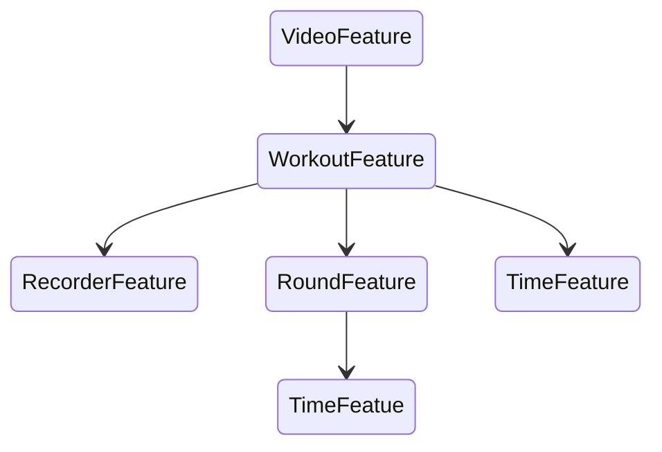

# in-workout-tools-sdk

## Description
The In-Workout Tools SDK is a toolkit for iOS developers to add workout recording and guidance features. It enables users to track workouts using heart rate and boxing sensors, providing real-time updates on stats like hits on the boxing bag, heart rate changes, and elapsed time. Developers can customise the workout views or use a ready-made video player tool for faster integration.

## Key Features
- Workout Recording: Recording of workouts using heart rate sensors and boxing sensors.
- Stat Updates: Real-time updates on user actions, including hits on the boxing bag, changes in heart rate, and time elapsed.
- Workout Control: Enables users to start, pause, and stop workouts.
- Customizable UI: Offers developers the flexibility to customise in-workout views.

## Tuist installation 
- Install Tuist with Homebrew: `brew install --cask tuist`, you will get the latest version of Tuist. 
If you want specific version: `brew install --cask tuist@x.y.z`

- If you cannot run tuist commands because developer cannot be verified, go to System Settings -> Privacy & Security and grant access or trust application.

- If you have Tuist already installed and having problems with older version or updating, you should deinstall it first.
If installed with Homebrew: `brew uninstall tuist`
Else: `curl -Ls https://uninstall.tuist.io | bash`

## Project setup
Run setup.sh script and you should be ready to go.
